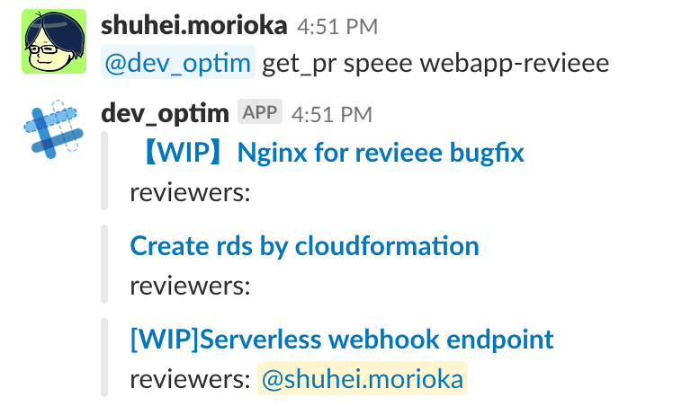

# serverless-prpolice

serverless-prpolice is an application to check GitHub pull requests by using slack.
This application mention to the user who set the GitHub account to this application.

# How to use




```
Usage
   @{bot_name} github account {your_account_name} # set your github account
   @{bot_name} get_pr {organization} {repository} # get pull request information
   @{bot_name} delete account {your_account_name} # delete github account from dynamodb
   @{bot_name} show users # show all github account in dynamodb
   @{bot_name} help # show commands
 Example
   @bot github account sample_account
   @bot get_pr selmertsx serverless-prpolice
   @bot delete account selmertsx
   @bot show users
```

# Deploy with cloudformation

1. create bot user
2. `copy .envrc.local.sample .envrc.local`
3. fill the items in .envrc.local
4. `direnv allow`
5. `yarn install`
6. `bin/prpolice deploy`

# License

This repository is under the [MIT License](LICENSE).
